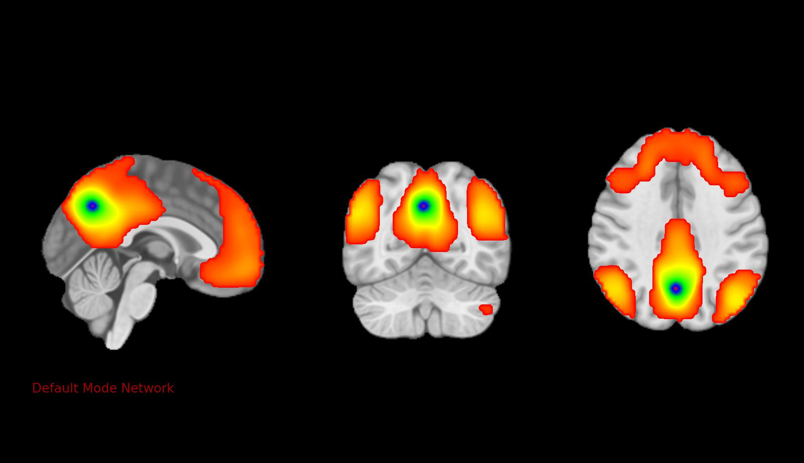

# fmriconnmap

## Change Log
[Change Log for this project](./CHANGELOG.md)

## Instructions
[Instructions for this project](./INSTRUCTIONS.md)

## Example Output for Default Mode Netowkr

## References
- Please cite AFNI gurus when using source code from this package <https://afni.nimh.nih.gov/pub/dist/doc/htmldoc/published/citations.html#afni-software-package>
- PA Taylor (NIMH. NIH) authored much of the source code <https://afni.nimh.nih.gov/pub/dist/doc/htmldoc/tutorials/rois_corr_vis/cat_netcorr.html>
- Default ROI locations were derived from the CONN toolbox networks.txt and atlas.txt files <https://web.conn-toolbox.org/home>; if using any of the default ROIs, please cite CONN toolbox: 
    - Whitfield-Gabrieli, S., & Nieto-Castanon, A. (2012). Conn: A functional connectivity toolbox for correlated and anticorrelated brain networks. Brain connectivity, 2(3), 125-141
    - Nieto-Castanon, A. (2020). Handbook of functional connectivity Magnetic Resonance Imaging methods in CONN. Boston, MA: Hilbert Press

